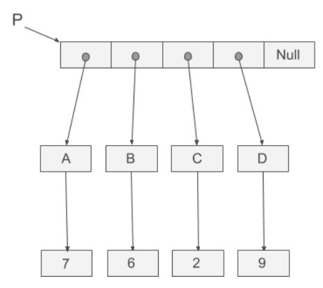

## Task Description ##
We are given a pointer *P* that points to a three-level memory structure. The first level is an array of pointers which ends with a NULL, and each of the non-null pointers in the array points to a pointer variable in the second level. Then each of these second level pointers point to an integer in the third level.  

Now, you need to traverse the first level array, and go to the integers in the third level through the pointers, and you need to count the number of first level pointers that can reach the same integer.  

Let us illustrate this task with two examples. In the first example, we assume that all pointers point to different locations, i.e., all mappings are one-to-one. Please refer to the following figure. As a result  each integer in the third level can be access by exactly one pointer from the first level.  



In the second example, we assume that some pointers may point to the same locations, i.e. the mapping is many-to-one. Please refer to the following figure.  


Write a function `count` to print the integers and the number of first level pointers that can reach them. The prototype of `count` function is as follows.
```c
void count(int **p[]);
```
The `count.h` is as follow:
```c
#ifndef COUNT_H_INCLUDED
#define COUNT_H_INCLUDED
void count(int **p[]);
#endif
```

You may use the following main function to test your function.

## Main Function 1 ##
```c
#include <stdio.h>
#include "count.h"

#define MAX_SIZE_PTRARRAY 512
#define MAX_NUM_PTR 512
#define MAX_NUM_INTVAR 512

int main(){
  int **ptrArray[MAX_SIZE_PTRARRAY] = {};
  int  *intPtr[MAX_NUM_PTR];
  int   intVar[MAX_NUM_INTVAR];

  intVar[0] = 7;
  intVar[1] = 6;
  intVar[2] = 2;
  intVar[3] = 9;
  ptrArray[0] = &intPtr[0];
  ptrArray[1] = &intPtr[1];
  ptrArray[2] = &intPtr[2];
  ptrArray[3] = &intPtr[3];
  ptrArray[4] = NULL;
  intPtr[0] = &intVar[0];
  intPtr[1] = &intVar[1];
  intPtr[2] = &intVar[2];
  intPtr[3] = &intVar[3];

  count(ptrArray);

  return 0;
}
```
## Main Function 2 ##
```c
#include <stdio.h>
#include "count.h"

#define MAX_SIZE_PTRARRAY 512
#define MAX_NUM_PTR 512
#define MAX_NUM_INTVAR 512

int main(){
  int **ptrArray[MAX_SIZE_PTRARRAY] = {};
  int  *intPtr[MAX_NUM_PTR];
  int   intVar[MAX_NUM_INTVAR];

  intVar[0] = 7;
  intVar[1] = 7;
  intVar[2] = 6;
  ptrArray[0] = &intPtr[0];
  ptrArray[1] = &intPtr[1];
  ptrArray[2] = &intPtr[2];
  ptrArray[3] = &intPtr[2];
  ptrArray[4] = &intPtr[3];
  ptrArray[5] = &intPtr[4];
  ptrArray[6] = NULL;
  intPtr[0] = &intVar[0];
  intPtr[1] = &intVar[1];
  intPtr[2] = &intVar[2];
  intPtr[3] = &intVar[2];
  intPtr[4] = &intVar[1];

  count(ptrArray);

  return 0;
}
```
## Subtask ##
- 30 points: The mapping is one to one.  
- 70 points: The mapping is many to one.

## Input Format ##
- 1 $\leq$ The max number of non-null pointers in the first level $<$ 512
- 1 $\leq$ The max number of pointers in second level $\leq$ 512
- 1 $\leq$ The max number of integer variables in third level $\leq$ 512

## Output Format ##
Print the integers and the number of first level pointers that can reach them. **You must print the integers in increasing order of the numbers of the first level pointers that can reach them. If two integers have the same numbers of the first level pointers that can reach them, print the smaller integer first.**

## Notes ##
You need to print the answers in your function.

## Sample Output 1 ##
```
2 1
6 1
7 1
9 1
```
## Sample Output 2 ##
```
7 1
7 2
6 3
```
## Compile ##
```
gcc -std=c99 -O2 -c main.c -lm
gcc -std=c99 -O2 -c count.c -lm
gcc -std=c99 -O2 count.o main.o -lm
```


