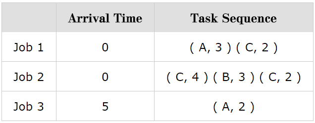

<!-- Machines and Jobs -->

## Task Description ##
We are given $M$ jobs that are processed on $N$ machines. A job can start only when it arrives. Each job consists of a sequence of tasks that must be done sequentially. Each task is a pair of integers ($i$, $t$), which means it takes time $t$ for machine $i$ to process this task. One machine can only process one task at a time.   

We will use a simple method to schedule the tasks of all jobs to run on the machines. We consider the first unprocessed task of all the jobs, and choose the one that has **the earliest completion time** if it is scheduled to run next. If there are multiple tasks that have the same earliest completion time, we schedule the task with the smaller job index, which is the order they appear in the input. We repeat this selection until all tasks are scheduled.  
 
Let us illustrate this simple method with an example. Assume that there are three machines $A$, $B$ and $C$ and three jobs, and the arrival time and the sequences of tasks are shown below. We use $Tij$ to represent the $j$-th task in the $i$-th job.  

<!--
   |       |Arrival Time |Task Sequence|
   |--------|:-----:|:-----:|
   |Job 1|0|( A, 3 ) ( C, 2 )|
   |Job 2|0|( C, 4 ) ( B, 3 ) ( C, 2 )|
   |Job 3|5|( A, 2 )|
-->




To compute the completion time of these three jobs, the program should do the following:

   1. The first unprocessed task in all the jobs are T11, T21, T31. Since all machines are available at time 0 and a job can start only when it arrives, the completion time of these tasks are (0 + 3), (0 + 4) and (5 + 2) respectively. The task T11 has the earliest completion time, so we schedule T11 first.
   2. After T11 has been scheduled, now the tasks we need to consider are T12, T21, T31. Because tasks in a job must be processed sequentially, T12 needs to wait until T11 is finished, the completion time of T12 is (3 + 2). The completion time of T21, T31 remain unchanged. The task T21 has the earliest completion time, therefore we schedule T21 to run next.
   3. Now the tasks we need to consider are T12, T22, T31. Because one machine can only process one task at a time, T12 needs to wait until T21 finishes on machine C. Therefore, the completion time of T12, T22, T31 are (4 + 2), (4 + 3) and (5 + 2) respectively, hence we schedule T12 next.
   4. Now the tasks we need to consider are T22, T31. Because this two tasks have the same completion time, we schedule the tasks according to their job index. Hence, T22 is scheduled to run next. 
   5. Now the tasks we need to consider are T23, T31. The completion time of T23, T31 are (7 + 2), (5 + 2) respectively, hence we schedule T31.
   6. There is only one remaining task T23, the completion time of this task is (7 + 2).  

Write a program to simulate the task scheduling and print the completion time of all jobs. It is guaranteed that there is at least one machine and job, and each job has at least one task.  


## Subtask ##
* 20 points: The arrival time of jobs are zero, and only one machine.  
* 40 points: The arrival time of jobs are zero, and there are multiple machines.  
* 40 points: The arrival time of jobs are non-zero, and there are multiple machines.  

## Input Format ##
The input contains only one test case. The first line contains two integers $N$, $M$, representing the number of machines and the number of jobs, and the following lines are $M$ job informations.  There are two lines for each job information. The  first line contains two integers $P$, $Q$, representing the arrival time of the job and the number of tasks in the job respectively. The second line contains a sequence of pairs ($i$, $t$) where $i$ is the index of the machine the task must be processed on, and $t$ is the time it takes on the machine. Machine index starts from 0.  

$ 0 < N, M < 500 $  
$ 0 \leq P < 100 $  
$ 0 < Q < 500 $  
$ 0 < t < 100 $  
$ 0 < $ Job Completion Time $ < 1000000 $
## Output Format ##
Print the completion time of all the jobs on separate lines.

## Hint ##
To solve this problem you need to remember the following states. First, you need to remember the ready time of all jobs, and the number of tasks you have finished for a job, so that you know which task is the next. Also you need to remember the ready time of all machines, so that you can compute the completion time of a task that will run on this machine. After selecting a task to run on a machine, you need to update both the information about the job and machine to reflect the fact that this task is already scheduled to run on that machine.   

## Sample Input ##
```
3 3
0 2
0 3 2 2
0 3
2 4 1 3 2 2
5 1
0 2
```
## Sample Output ##
```
6
9
7
```


