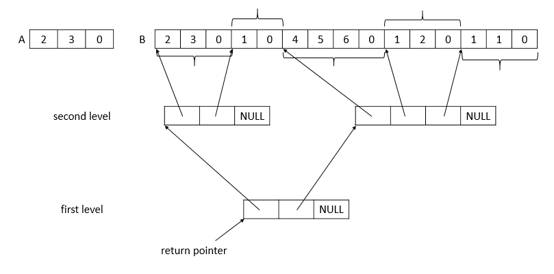

<!-- Two-level Table -->
Write a function to construct a two-level table.

## Task Description ##
We are given two arrays $A$ with $N$ integers and $B$ with $M$ integers. Each element of $A$ indicates the size of a second level table, and ends with $0$. The array $B$ consists of partitions that end with $0$. For example, if $B = \{2, 3, 0, 1, 0, 4, 5, 6, 0, 1, 2, 0, 1, 1, 0\}$, then the five partitions are $\{2, 3, 0\}, \{1, 0\}, \{4, 5, 6, 0\}, \{1, 2, 0\}, \{1, 1, 0\}$.

Now you need to construct a two-level table and return a pointer to the starting address of the first level table. The first level array has $N - 1$ pointers, and each of them points to a second level array, and it ends with a NULL pointer. As a result there are $N-1$ second level pointer arrays, and the size of each array is indicated by the corresponding element in array $A$. Each element of a second level arrays is a pointer to the starting address of the corresponding partition in $B$. Similar to the first level array, each second level array ends with a NULL pointer. Please refer to the following figure. 
<div class="pure-g">
	<div class="pure-u-1-1"><span class="caption" >p-10179. Table</span></div>
</div>
You need to write a function constructTable, that given array $A$ and $B$, build the first and the second level tables, and return the starting address of the first level table. The prototype of constructTable function is as follows.

```c
int ***constructTable(int A[], int B[]);
```

You may use the following main function to test your function.

```c
#include <stdio.h>
#include "constructTable.h"

int main(){
    int N, M;
    int A[100] = {}, B[500] = {};
    scanf("%d%d", &N, &M);
    for(int i = 0; i < N; i++)
        scanf("%d", &A[i]);
    for(int i = 0; i < M; i++)
        scanf("%d", &B[i]);

    int ***ptr;
    ptr = constructTable(A, B);
    for(int i = 0; *(ptr+i) != NULL; i++)
        for(int j = 0; j < A[i]; j++)
            for(int k = 0; *(*(*(ptr+i)+j)+k) != 0; k++)
                printf("%d ", *(*(*(ptr+i)+j)+k));
    return 0;
}
```

The constructTable.h is as follow:

```c
int ***constructTable(int A[], int B[]);
```

## Note ##
Feel free to use malloc if you know how to. Otherwise declare the first and the second level tables **outside** of your function to make them global, so that our main program can access them. Also the second level pointer must point into $B$. You may not declare another integer array to store them.
## Subtask ##
- 30 points: Every partition has exactly one element, i.e., it has one nonzero element followed by a $0$.
- 30 points: All partitions have the same number of elements.
- 40 points: Not all partitions have the same number of elements.

## Input Format ##
The input contains only one test case. The first line contains two integers $N$, $M$, representing the size of array $A$ and $B$. The second line contains $N$ integers, representing the elements of array $A$. The third line contains $M$ integers, representing the elements of array $B$.

- $1 < N < 100$
- $1 < M  < 5000$
- $0 < $ size of each second level table $< 100$
- $0 < $ elements of each partition $< 100$

## Output Format ##
Print the elements of array $B$ except $0$ in a line. 

## Sample Input 1 ##
```
3 10
3 2 0
6 0 5 0 5 0 3 0 5 0
```
## Sample Output 1 ##
```
6 5 5 3 5
```
## Sample Input 2 ##
```
6 15
1 1 1 1 1 0
2 1 0 4 7 0 4 8 0 3 6 0 4 7 0 
```
## Sample Output 2 ##
```
2 1 4 7 4 8 3 6 4 7
```
## Sample Input 3 ##
```
3 15
2 3 0
2 3 0 1 0 4 5 6 0 1 2 0 1 1 0 
```
## Sample Output 3 ##
```
2 3 1 4 5 6 1 2 1 1 
```
