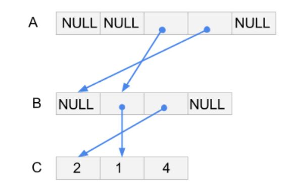

<!-- Pointer Chasing  -->

## Task Description ##
Build pointer linkage to link three arrays. There are three arrays A, B and C. A is an array of pointers, and each non-NULL element points to an element of B. Similarly B is an array of pointers, and each non-NULL element points to an element of C.

We build the linkage according to instructions. **First you need to initialize all elements in A and B to NULL**. Then if the instruction is A n B m, then we set A[n] point to B[m]. If the instruction is B n C m, then we set B[n] point to C[m]. In all other cases we consider the instruction invalid, and simply ignore this line of instruction. Note that n and m are strings of digits only, i.e., they consist of only '0' to '9', e.g., '009' and '102'.  If the command is valid then you will print a 1; otherwise you will print a 0.

Let us illustrate this task with an examples. Given A, B, C of size 5, 4, 3 and the instructions as follow:
```c
A 2 B 1
A 3 C 1
A 2 A 1
B 2 C 0
B 1 C 1
B 1 C 5
(T.T)\(^_^) (-.-;)y-~~(^_<)
A 2 B 1 A 2 B 1
A B A B
AA BB CGHD
A 3 B
  A 3 B 0
```
You need to print:
```c
1
0
0
1
1
0
0
0
0
0
0
1
```
The structure of A, B and C become:

The prototype of chasing function is as follows.
```c
void chasing(int **A[], int a, int *B[], int b, int C[], int c);
```
You may use the following main function to test your function. 

Main Function
```c
#include <stdio.h>
#include "chasing.h"
int main() {
        int a = 5, b = 4, c = 3;
        int **A[5] = {}, *B[4] = {}, C[3] = {2, 1, 4};
        chasing(A, a, B, b, C, c);

        int **ansA[5] = {} ,*ansB[4] = {};
        for (int i = 0; i < a; i++)
                ansA[i] = NULL;
        for (int i = 0; i < b; i++)
                ansB[i] = NULL;
        ansA[2] = &B[1], ansA[3] = &B[0], ansB[1] = &C[1], ansB[2] = &C[0];
        /*Check A*/
        for (int i = 0; i < a; i++)
                if (A[i] != ansA[i] )
                        printf("A[%d] wrong answer!\n", i);

        /*Check B*/
        for (int i = 0; i < b; i++)
                if (B[i] != ansB[i] )
                        printf("B[%d] wrong answer!\n", i);
		return 0;
}
```
## Subtask ##
- $30$ points: All the instructions are valid. 
- $30$ points: The Instruction is always **character integer character integer**.
- $40$ points: There could be invalid commands. 

## Input Format ##

There are many lines in the input file, each line is an instruction(length < 64).

## Output Format ##
Build the linkage in the A and B array. Print 0 in a new line if you read an invalid instruction, print 1 in a new line if you read an valid instruction.

## Sample Input 1 ##
```c
A 0 B 0
A 1 B 2
B 0 C 2
B 1 C 1
```
## Sample main function 1##
```c
#include <stdio.h>
#include "chasing.h"
int main() {
        int a = 3, b = 3, c = 3;
        int **A[3] = {}, *B[3] = {}, C[3] = {2, 1, 4};
        chasing(A, a, B, b, C, c);

        int **ansA[3] = {} ,*ansB[3] = {};
        for (int i = 0; i < a; i++)
                ansA[i] = NULL;
        for (int i = 0; i < b; i++)
                ansB[i] = NULL;
        ansA[0] = &B[0], ansA[1] = &B[2], ansB[0] = &C[2], ansB[1] = &C[1];
        /*Check A*/
        for (int i = 0; i < a; i++)
                if (A[i] != ansA[i] )
                        printf("A[%d] wrong answer!\n", i);

        /*Check B*/
        for (int i = 0; i < b; i++)
                if (B[i] != ansB[i] )
                        printf("B[%d] wrong answer!\n", i);
        return 0;

}
```
## Sample Output 1 ##
```c
1
1
1
1
```
## Sample Input 2 ##
```c
A 0 B 1
A 1 A 1
A 1 C 3
B 1 D 1
B 1 C 5
```
## Sample main function 2 ##
```c
#include <stdio.h>
#include "chasing.h"
int main() {
        int a = 3, b = 3, c = 3;
        int **A[3] = {}, *B[3] = {}, C[3] = {2, 1, 4};
        chasing(A, a, B, b, C, c);

        int **ansA[3] = {} ,*ansB[3] = {};
        for (int i = 0; i < a; i++)
                ansA[i] = NULL;
        for (int i = 0; i < b; i++)
                ansB[i] = NULL;
        ansA[0] = &B[1];;
        /*Check A*/
        for (int i = 0; i < a; i++)
                if (A[i] != ansA[i] )
                        printf("A[%d] wrong answer!\n", i);

        /*Check B*/
        for (int i = 0; i < b; i++)
                if (B[i] != ansB[i] )
                        printf("B[%d] wrong answer!\n", i);
        return 0;

}

```
## Sample Output 2 ##
```c
1
0
0
0
0
```
## Sample Input 3##
```c
A 2 B 1
A 3 C 1
A 2 A 1
B 2 C 0
B 1 C 1
B 1 C 5
(T.T)\(^_^) (-.-;)y-~~(^_<)
A 2 B 1 A 2 B 1
A B A B
AA BB CGHD
A 3 B
	A 3 B 0
```
## Sample main function 3##
```c
#include <stdio.h>
#include "chasing.h"
int main() {
        int a = 5, b = 4, c = 3;
        int **A[5] = {}, *B[4] = {}, C[3] = {2, 1, 4};
        chasing(A, a, B, b, C, c);

        int **ansA[5] = {} ,*ansB[4] = {};
        for (int i = 0; i < a; i++)
                ansA[i] = NULL;
        for (int i = 0; i < b; i++)
                ansB[i] = NULL;
        ansA[2] = &B[1], ansA[3] = &B[0], ansB[1] = &C[1], ansB[2] = &C[0];
        /*Check A*/
        for (int i = 0; i < a; i++)
                if (A[i] != ansA[i] )
                        printf("A[%d] wrong answer!\n", i);

        /*Check B*/
        for (int i = 0; i < b; i++)
                if (B[i] != ansB[i] )
                        printf("B[%d] wrong answer!\n", i);
		return 0;
}
```

## Sample Output 3##
```c
1
0
0
1
1
0
0
0
0
0
0
1
```
