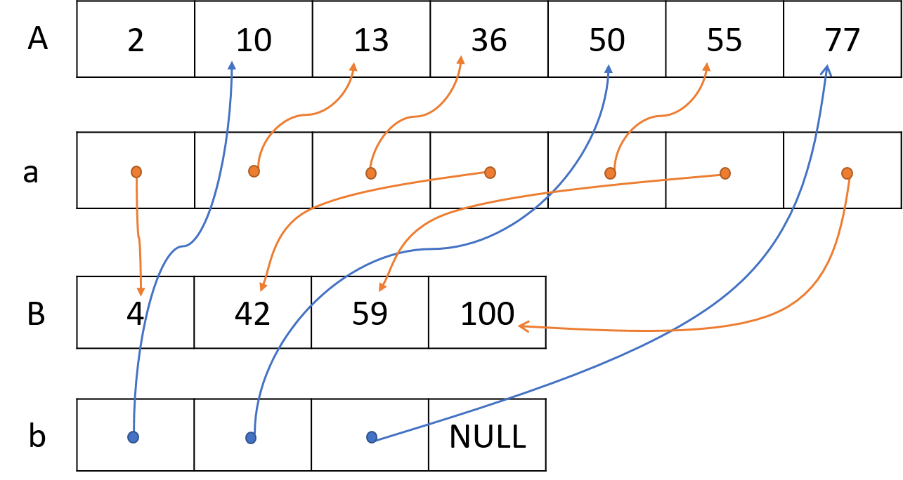

<!-- Line Up Numbers -->

## Task Description ##
There are two integer arrays $A$ and $B$ of sizes $N$ and $M$ respectively.
The elements of $A$ and $B$ are in increasing order.
Both A and B have a pointer array a and b of the same size. 
The pointer $a[i]$ is pointing to $A[i + 1]$ and so on, and $a[N - 1]$ is NULL. 
That is, $a[i]$ points to the next value in the $A$ after $A[i]$.
The values of $b[i]$ are similarly defined as in $a$.
Please refer to the following figure for an illustration.


Now write a function to *merge* list A and B.
That is, after the merging a[i] should point to the next elelement after A[i] in the list of the elements from *both* A and B.
Similarly, b[i] should point to the next elelement after B[i] in the list of the elements from *both* A and B.
After the merge we will have a pointer *head* pointering $A$, since $A[0]$ is $2$ and is smaller than $B[0]$. 
Then $a[0]$ should point to $B[0]$, since $B[0]$ is smaller than $A[1]$.
Then $b[0]$ should point to $A[1]$, since it has the third smallest number $10$. 
$a[1]$ should point to $A[2]$, which is $13$, the fourth smallest number, and so on.
Finally $b[3]$ will have NULL since it is the largest number in both $A$ and $B$.



The prototype of header `merge.h` is as follows.
(Remember to include stdio.h in merge.c.)
```
#include <stdio.h> 
void merge(int A[], int B[], int* a[], int* b[]);
```

Here is the template of `merge.c`:
```
#include <stdio.h>
void merge(int A[], int B[], int* a[], int* b[]){
    // your implementation here
}
```

You can use the following main function to test your merge function.
```
#include <stdio.h>
#include "merge.h"
int main()
{
    int A[10], B[10];
    int *a[10], *b[10], *ans_a[10], *ans_b[10];
    int i, N, M;

    scanf("%d%d", &N, &M);
    for(i = 0; i < N; i++)
        scanf("%d", &A[i]);
    for(i = 0; i < M; i++)
        scanf("%d", &B[i]);
    for(i = 0; i < N-1; i++)
        a[i] = &A[i+1];
    a[N-1] = NULL;
    for(i = 0; i < M-1; i++)
        b[i] = &B[i+1];
    b[M-1] = NULL;

    merge(A, B, a, b);

    ans_a[0] = &B[0];
    ans_a[1] = &A[2];
    ans_a[2] = &A[3];
    ans_a[3] = &B[1];
    ans_a[4] = &A[5];
    ans_a[5] = &B[2];
    ans_a[6] = &B[3];

    ans_b[0] = &A[1];
    ans_b[1] = &A[4];
    ans_b[2] = &A[6];
    ans_b[3] = NULL;


    for(i = 0; i < N; i++){
        if(a[i] != ans_a[i])
            printf("a[%d] is Wrong!\n", i);
    }
    for(i = 0; i < M; i++){
        if(b[i] != ans_b[i])
            printf("b[%d] is Wrong!\n", i);
    }
    printf("Finish!\n");
    return 0;
}

```


## Input Format ##
The first line has two integer $N$ and $M$.
They are sizes of array $A$ and $B$.
The second line has $N$ integers, which are elements of array $A$.
The third line has $M$ integers, which are elements of array $B$.
All of the numbers of $A$ and $B$ are *unique*.


## Output Format ##
If your function is correct, the sample output will have only one line and that is “Finish!”.
If your function is wrong, the sample output will show error messages.
(If there are too many error messages, you will get "OLE".)

## Subtasks ##
* 10 points: Both arrays $A$ and $B$ have only one element.
* 30 points: Either $A$ or $B$ has only one element.
* 60 points: General cases.

## Sample Input ##
```
7 4
2 10 13 36 50 55 77
4 42 59 100
```
## Sample Output ##
```
Finish!
```
## Hint ##
For general cases you can use two integers to keep track of which part of $A$ and $B$ you have processed.
If the one integer pointed by $A$ is smaller, then it is the next one in the list.
After linking it to the end of the current list you increase $A$ and go on.
If the one pointered by $B$ is smaller than you do the same for $b$.
You stop until one list stops.
See the following pseudo code.

```
FindSmall ( int A[], int B[] )
{
    i = 0   // index of array A
    j = 0   // index of array B

    while ( i or j < size of A or B ):
        if  A[i] < B[j]:
            A[i] is the smallest number of remaining numbers.
            Connect the pointer you need to do.
            i++
        else
            B[j] is the smallest number of remaining numbers.
            Connect the pointer you need to do.
            j++

    if  i == size of A:
        for j to size of B:
            complete remaining numbers in B.
    else if  j == size of B:
        for i to size of A:
            complete remaining numbers in A.
}

```
