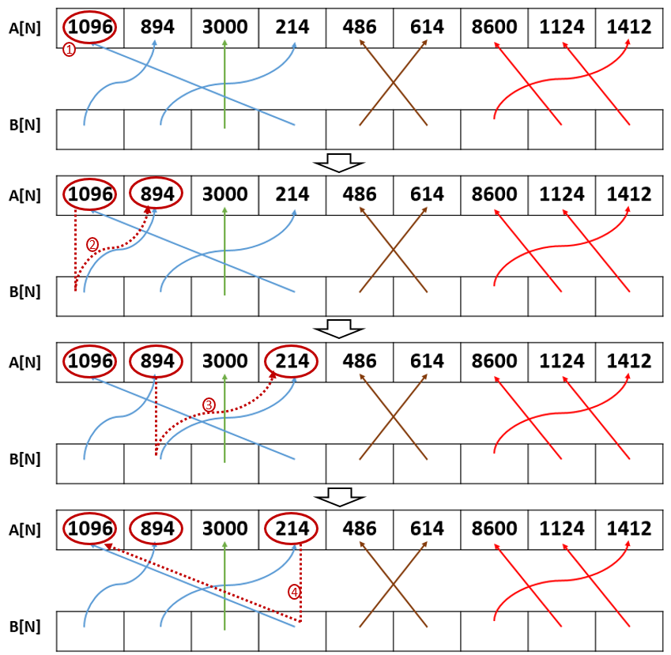

<!-- Loops -->

## Task Description ##
We have two arrays $A$ and $B$ of size $N$. The elements in $A$ are distinct positive integers, and the elements in $B$ are integer pointers. Each pointer in $B$ will point to an element in $A$, and each element in $A$ will be pointed by exactly one pointer in $B$.


We will find $loops$ in $A$. For example, in the figure above if we start from ‘1096’ and then follow the pointer in $B$, we will visit ‘1096’, ‘894’, ‘214’, then finally ‘1096’. This forms a loop (‘1096’, ‘894’, ‘214’). Since every element in $B$ points to an element in $A$, and every element in $A$ is pointed by an element in $B$, every element in $A$ is in a loop. In the example above we can find $four$ loops in $A$ marked by arrows in four different colors. We can find all loops by following the pointers in B, as in the following fgiure.



Write a function $loops$ to determine the the maximum element in the longest loop (and its length), and the minimum element in the shortest loop (and its length).
For example in the figure above the the length of the longest loop is 3, and 8600 is the maximum in it.
The length of the shortest loop is 1, and 3000 is the minimum in it.
Your $loops$ should place these information in the $ans$ array according to the order defined in the output format section below.
Note that there may be *multiple* longest loops, and you need to find the maximum element in A among them.
The same is true for the shortest loops, but you need to find the minimum element among them instead.

The prototype of the $loops.h$ is as follows.
```
void loops(int N, int *A, int *B[], int ans[4]);
```

You can use the following $main.c$ to test your partition function.
```
#include <stdio.h>
#include <stdlib.h>
#include "loops.h"
#define MAXN 1000000
int main(){
	int N;
    int *A = (int *)malloc(sizeof(int) * MAXN);
    int **B = (int **)malloc(sizeof(int *) * MAXN);
    scanf("%d", &N);
    for(int i = 0; i < N; i++)
    	scanf("%d", A + i);
    for(int i = 0, ptr; i < N; i++){
    	scanf("%d", &ptr);
        B[i] = A + ptr;
    }
    int ans[4];
    loops(N, A, B, ans);
    for(int i = 0; i < 4; i++)
    	printf("%d\n", ans[i]);
    return 0;
}
```

## Input Format (for the test main program)##
The first line contains one integer $N$. The second line has $N$ distinct positive integers. And the third line is a permutation from 0 to $N-1$, representing the indices of the elements $B$ needs to point to in $A$.
* $1 \leq N \leq 10^6$

## Output Format (for the test main program)##
There are four integers in the output ($ans$ orderly): the length of the longest loop, the length of the shortest loop, the maximum in the longest loop, and the minimum in the shortest loop. You need to place those values in ans in order. Do not print anything in your $“loops"$.

## Hint ##
If you want to solve the third subtask, use an array $visited$ of size $N$ to record whether an element of $A$ has been visited or not. When you want to find the next loop in $A$, you should start from an element in A whose corresponding element in $visited$ indicates that this element of $A$ has $not$ been visited.

## Subtasks ##
* 10 points: there is only one loop
* 30 points: there are two loops
* 60 points: there could be many loops, and you need to follow the hint to get all points.

## Sample Input##
```
9
1096 894 3000 214 486 614 8600 1124 1412
1 3 2 0 5 4 8 6 7
```
## Sample Output##
```
3
1
8600
3000
```
## Sample for subtask 1 ~ 3##
Inside the testdata.
