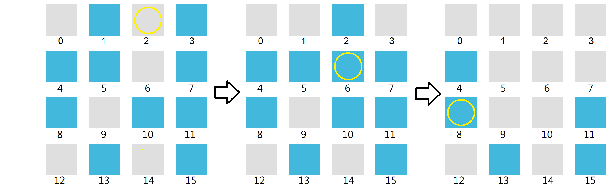

<!-- Lights Out -->

## Task Description
Let us play *Lights Out*.

*Lights Out* is a puzzle game consisting of an $N$ by $N$ grid of lights which can be turned on and off.
Each of these $N^2$ lights has an id from $0$ to $N^2-1$ from left to right, and from top to bottom.
When the game starts, a random number of these lights are turned on. 
Please refer to the following figure.


Pressing any of the lights will toggle it and all of its immediate vertical and horizontal neighbors.
The goal of the puzzle is to turn off *all* the lights with the minimum number of pressing. 
Note that the order in which the lights are pressed does *not* affect the results.
Also note that we do not need to press a light more than once since pressing it twice is the same as not to press it at all.
Please refer to the following figure.




Write a program to find the minimumn set of lights that need to be pressed to turn off all lights.
If there are multiple sets of them, output the first one in dictionary order.
For example, 1 2 4 appears earlier than 1 3 4 in the dictionary order.

## Input Format ##
The first line is $N$. 
The second line has the indices of the lights that were on when the game started.
It is guaranteed that a solution always exists for the input.
* $3 ≤ N ≤ 4$

## Output Format##
Print the indices of the lights that need to be pressed in *ascending* order.
If there are multiple answers, output the first one in dictionary order.

## Sample Input 1
```
4
1 3 4 5 7 8 10 11 13 15
```
## Sample Output 1
```
2 6 8 13 15
```

## Sample Input 2
```
3
1 4 7 8
```
## Sample Output 2
```
0 1 4 5
```

## Sample Input 3
```
4
0 1 2 6 10 11 12 13 15
```
## Sample Output 3
```
0 6 8 9 11
```

