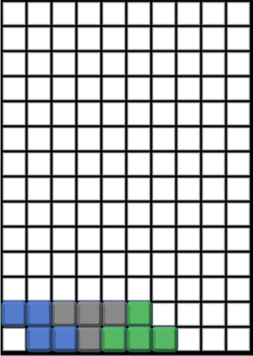
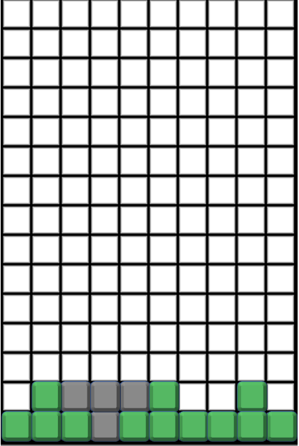

## Task Description
Write a program to simulate Tetris. 
We have a playing field of `n` columns from left to right indexed from 0 to `n-1`.
For simplicity, there are only four types of Tetris pieces numbered from 0 to 3 illustrated below. 
Each Tetris piece consists of four squares. 
The Tetris pieces fall vertically into the playing without rotation nor horizontal movement and stack on one another.
Please write a program to compute the height of each column in the playing field after all Tetris pieces fall and stick into position. 
For simplicity, no squares will disappear as they do in an accurate Tetris simulation.

   
   



## Subtask
* 20 points: All pieces are type 0.
* 80 points: There are four types of Tetris pieces.

## Input Format
The first line has the width of the playing field -- `n`. 
Each of the following lines has two numbers, `a` and `b`, representing the column of the left-most column location of a piece and the type of the piece. 
You need to process all lines until EOF.
* $3 ≤ n ≤ 100000$
* $0 ≤ a ≤ n-3$
* $0 ≤ b ≤ 3$

## Output Format
There are `n` numbers in a line representing the height of each column.

## Note
You do not need a two-dimensional matrix to store the pieces. 
You only need an array to store the heights of columns.

## Sample Input 1
```
10
0 0
4 2
2 3
```

## Sample Output 1
```
2 2 2 2 2 2 1 0 0 0
```

## Sample Input 2
```
10
0 2
4 2
7 2
2 3
```

## Sample Output 2
```
1 2 2 2 2 2 1 1 2 1
```

## Estimated Cyclomatic Number ##
```
6.4
```

<!-- Editor: 邱麒羽 -->
