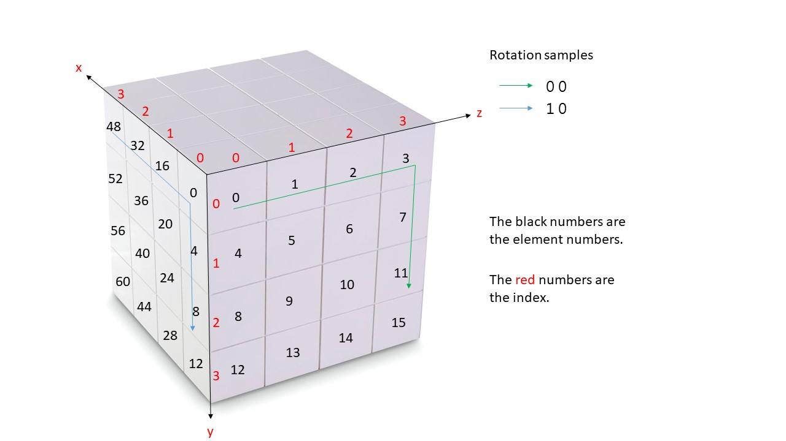

## Task Description ##
Write a program to simulation the rotations for a Rubik's Cube.
A Rubik's Cube is an $N$ by $N$ by $N$ matrix.
For simplicity, we assume that there are only two types of rotations for a Rubik's Cubic, and we denote them as the blue and the green lines in the following figure.
The elements in the matrix are from 0 to $N^3-1$ in [x][y][z] order.




## Input Format ##
The first line has $N$ and $M$.
$N$ is between 3 and 100, inclusively.
Each of the following $M$ lines has two integers.
The first integer represents the type of the rotation, 0 for green and 1 for blue, as in the figure above.
The second integer represents the index of the matrix layer to rotate.

## Output Format ##
The output is the final contents of the matrix.
There are $N^2$ lines, and each of them has the elements of a row in the matrix.

## Subtask ##
* 50 points: There are only green rotations.
* 50 points: Both green and blue rotations are possible.

## Note ##
During your local testing, you may experience RE when you declare a 100 by 100 by 100 matrix in the main function. 
This will not affect the grading since the server setting can handle a 100 by 100 by 100 matrix, plus another 100 by 100 matrix.
You may want to limit the size of the matrix during local testing, but do remember to set the size to the specified number when you submit it to the system.

## Sample Input 1
```
4 1
0 0
```

## Sample Output 1
```
12 8 4 0
13 9 5 1
14 10 6 2
15 11 7 3
16 17 18 19
20 21 22 23
24 25 26 27
28 29 30 31
32 33 34 35
36 37 38 39
40 41 42 43
44 45 46 47
48 49 50 51
52 53 54 55
56 57 58 59
60 61 62 63

```

## Sample Input 2
```
3 2
0 1
1 0
```

## Sample Output 2
```
3 2
0 1
1 0
18 1 2
15 4 5
0 7 8
21 12 9
16 13 10
3 14 11
24 19 20
17 22 23
6 25 26
```

## Estimated Cyclomatic Number ##
```
15.61
```
