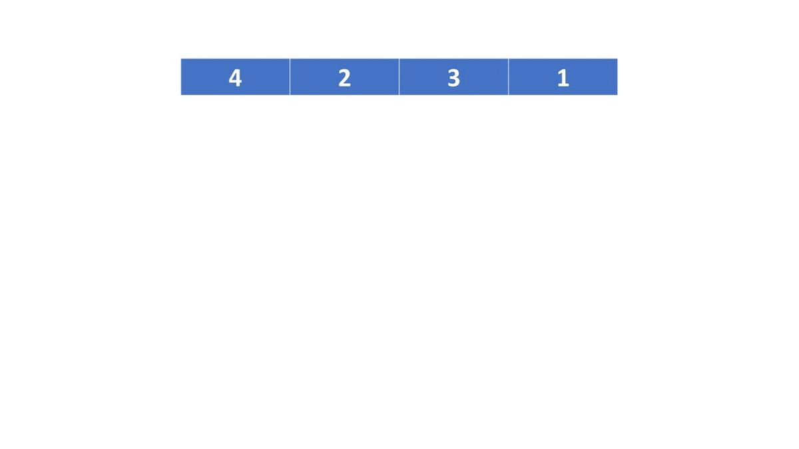

## Task Description ##
Write a program to sort an array of $N$ integers with *merge sort*.
The merge sort works recursively as follows.
- The merge sort first divides the array into two halves.
The first half has $\lfloor\frac{N}{2}\rfloor$ elements, and the second half has $N - \lfloor\frac{N}{2}\rfloor$.
- The merge sort then sorts both halves *recursively*.
That is, it recursively sorts these two halves by calling the same function on the first half, then on the second half.
- Now we have two sorted arrays. 
The merge sort then merges the two sorted arrays into the final sorted array.
Since both arrays are now in sorted order, we can merge them easily by choosing the *smaller* one at the beginning of the two arrays as the next element in the final result, and repeat this process until one array becomes empty.
Then we copy the other array into the final result.




## Limits ##

$N$ is no more than $100000$.

## Input Format ##

The input has one line of integers to sort.

## Output Format ##
Your recursive sorting function needs to print the input array *before and after* sorting the array. 
The only exception is that when the input array has only one element, your sorting function only needs to print it once.
Please refer to the following samples in detail.

## Sample Description ##
The purpose of the first two samples is to make sure that the program can process odd and even numbers of integers.
The purpose of the third sample is to make sure that the program can run the input having negative or duplicate integers.
We generate the three samples manually.

## Sample Input 1 ##
```
4 2 3 1
```

## Sample Output 1 ##
```
4 2 3 1
4 2 
4 
2 
2 4 
3 1 
3 
1 
1 3 
1 2 3 4 
```


## Sample Input 2 ##
```
1 4 2 5 3
```

## Sample Output 2 ##
```
1 4 2 5 3
1 4 
1 
4 
1 4 
2 5 3 
2 
5 3 
5 
3 
3 5 
2 3 5 
1 2 3 4 5 
```

## Sample Input 3 ##
```
-1 2 5 5 -3 -1 0 4 6 9 0 48 -7 8 -3
```

## Sample Output 3 ##
```
-1 2 5 5 -3 -1 0 4 6 9 0 48 -7 8 -3
-1 2 5 5 -3 -1 0 
-1 2 5 
-1 
2 5 
2 
5 
2 5 
-1 2 5 
5 -3 -1 0 
5 -3 
5 
-3 
-3 5 
-1 0 
-1 
0 
-1 0 
-3 -1 0 5 
-3 -1 -1 0 2 5 5 
4 6 9 0 48 -7 8 -3 
4 6 9 0 
4 6 
4 
6 
4 6 
9 0 
9 
0 
0 9 
0 4 6 9 
48 -7 8 -3 
48 -7 
48 
-7 
-7 48 
8 -3 
8 
-3 
-3 8 
-7 -3 8 48 
-7 -3 0 4 6 8 9 48 
-7 -3 -3 -1 -1 0 0 2 4 5 5 6 8 9 48 
```

## Estimated Cyclomatic Number ##
```
9.09
```
